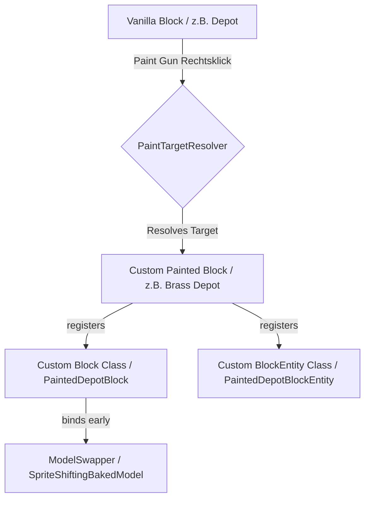

# Entwickler-Dokumentation: Block-Registrierung & Paint-System

Diese Dokumentation dient als Leitfaden für Entwickler, um zu verstehen, wie die benutzerdefinierten bemalten Blöcke (Custom Painted Blocks) im Mod registriert sind, wie das Paint-System funktioniert und wie neue Blöcke hinzugefügt werden können.

---

## 1. System-Übersicht

Das Paint-System von *Create: Crafts & Construct* ermöglicht es Spielern, bestimmte Funktionsblöcke (z. B. Tanks, Rohre, Getriebe, Kolben, Dampfmaschinen) mit der **Paint Gun** zu besprühen. Dadurch wird der Block in eine andere Materialvariante (Andesit, Messing, Kupfer, Zug/Stahl) umgewandelt, wobei seine Funktionalität erhalten bleibt.

Da viele dieser Blöcke komplexe Funktionalitäten (Block Entities, Kinetics, Fluid-Netzwerke) besitzen, reicht ein einfacher Textur-Austausch nicht aus. Stattdessen besitzt jede Materialvariante eine eigene Block- und Block-Entity-Registrierung, die sich wie das Vanilla-Create-Pendant verhält, aber auf die spezifischen Texturen und Modell-Klassen verweist.



---

## 2. Wo und wie Blöcke registriert werden

Die Registrierung neuer bemalter Blöcke erfolgt in vier zentralen Schritten auf der Serverseite und drei Schritten auf der Clientseite.

### Schritt 2.1: ModBlocks.java
In [ModBlocks.java](file:///e:/IJ/Create-Crafts-Construct/src/main/java/net/buildercraft/registry/ModBlocks.java) werden alle Blöcke und BlockItems registriert.

1. **Ziele definieren (`TEMP_PAINT_TARGETS`)**:
   Jeder bemalbare Blocktyp besitzt ein internes Identifikations-Kürzel in dieser Liste:
   ```java
   public static final List<String> TEMP_PAINT_TARGETS = List.of(
       "fluid_pipe", "smart_fluid_pipe", "mechanical_pump", "fluid_valve", 
       "valve_handle", "fluid_tank", "horizontal_fluid_tank", "spout", 
       "depot", "weighted_ejector", "clutch", "gearshift", ...
   );
   ```
2. **Materiallisten anlegen**:
   Für jeden Blocktyp wird eine Liste zur automatischen Sammlung aller registrierten Varianten benötigt (z. B. `PAINTED_DEPOTS`):
   ```java
   public static final List<DeferredBlock<Block>> PAINTED_DEPOTS = new ArrayList<>();
   ```
3. **Varianten registrieren (`registerTempPaintBlocks`)**:
   Die Hilfsmethode läuft durch alle Materialien (Andesit, Brass, Copper, Train) und erzeugt die Blöcke:
   ```java
   private static void registerTempPaintBlocks(String target) {
       for (PaintMaterial material : PaintMaterial.values()) {
           // Kupfer ist meistens das Basis-Material aus Create, das überspringen wir außer bei Ausnahmen
           if (material == PaintMaterial.COPPER && baseMaterialFor(target) == PaintMaterial.COPPER) continue;
           
           String name = material.getSerializedName() + "_" + target;
           DeferredBlock<Block> block = BLOCKS.register(name, () -> createTempPaintBlock(name, target));
           registerBlockList(target, block); // Fügt den Block der passenden Liste (z.B. PAINTED_DEPOTS) hinzu
           registerBlockItem(name, block);
       }
   }
   ```
4. **Custom Block Klasse erzeugen (`createTempPaintBlock`)**:
   Hier wird der Block mit seiner spezifischen Logik instantiiert. Jede bemalte Variante nutzt eine eigene Block-Klasse, die von der originalen Create-Klasse erbt:
   ```java
   case "depot" -> new PaintedDepotBlock(properties, () -> ModBlockEntityTypes.PAINTED_DEPOT.get());
   ```

### Schritt 2.2: ModBlockEntityTypes.java
Damit die bemalten Blöcke ihre Funktionalität behalten, müssen sie eine Block Entity (BE) besitzen. In [ModBlockEntityTypes.java](file:///e:/IJ/Create-Crafts-Construct/src/main/java/net/buildercraft/registry/ModBlockEntityTypes.java) werden diese registriert:
```java
public static final DeferredHolder<BlockEntityType<?>, BlockEntityType<PaintedDepotBlockEntity>> PAINTED_DEPOT =
        BLOCK_ENTITY_TYPES.register("painted_depot", () -> BlockEntityType.Builder.of(
                PaintedDepotBlockEntity::new,
                blocks(ModBlocks.PAINTED_DEPOTS) // Bindet alle registrierten bemalten Depots an diesen BE-Typ
        ).build(null));
```

### Schritt 2.3: PaintTargetResolver.java
In [PaintTargetResolver.java](file:///e:/IJ/Create-Crafts-Construct/src/main/java/net/buildercraft/util/PaintTargetResolver.java) wird das Mapping definiert (welcher Block verwandelt sich in welchen anderen):
1. **`CREATE_BASE_MATERIALS`**: Definiert das Standard-Material des Original-Blocks aus Vanilla Create (z. B. ist das Standard-Depot aus Andesit):
   ```java
   Map.entry("depot", PaintMaterial.ANDESITE)
   ```
2. **`CUSTOM_MATERIALS`**: Definiert, in welche bemalten Varianten das Objekt umgewandelt werden darf:
   ```java
   Map.entry("depot", Set.of(PaintMaterial.BRASS, PaintMaterial.COPPER, PaintMaterial.TRAIN))
   ```
3. **`isFunctionalCraftsConstructVariant`**: Registriert den String-Kürzel als bemalbare Mod-Kategorie:
   ```java
   case "depot" -> true;
   ```

### Schritt 2.4: Datengenerierung & Tags
Der neue Block muss in den Tags als bemalbar eingetragen werden:
* **Blöcke**: `src/main/resources/data/crafts_construct/tags/block/paint/paintable.json`
* **Items**: `src/main/resources/data/crafts_construct/tags/item/paint/paintable.json`
* **Konfiguration**: `src/main/resources/config/paintgun/paintable.json`

---

## 3. Custom-Klassen & Vererbung (Code-Design)

Alle bemalten Blöcke müssen das Verhalten ihrer Create-Vorbilder exakt kopieren. Das erreichen wir durch Vererbung und Delegierung.

### Beispiel: Block-Klasse
```java
public class PaintedDepotBlock extends DepotBlock {
    private final Supplier<BlockEntityType<? extends DepotBlockEntity>> blockEntityType;

    public PaintedDepotBlock(Properties properties, Supplier<BlockEntityType<? extends DepotBlockEntity>> blockEntityType) {
        super(properties);
        this.blockEntityType = blockEntityType;
    }

    @Override
    public BlockEntityType<? extends DepotBlockEntity> getBlockEntityType() {
        return blockEntityType.get(); // Gibt den bemalten BE-Typ zurück statt des Create-Standardtyps
    }
}
```

### Beispiel: BlockEntity-Klasse
```java
public class PaintedDepotBlockEntity extends DepotBlockEntity {
    public PaintedDepotBlockEntity(BlockEntityType<?> type, BlockPos pos, BlockState state) {
        super(type, pos, state);
    }
    
    // Falls das Original-Create-Verhalten hartcodierte Block-Prüfungen durchführt, 
    // müssen diese Methoden überschrieben werden (oft über Mixins geregelt).
}
```

---

## 4. Client-seitige Registrierung & Rendering

Das optische Highlight der bemalten Blöcke ist das Rendering. Hier nutzen wir die Catnip/Create Render-Infrastruktur.

### Schritt 4.1: Model Swapping (Modelle zur Backzeit austauschen)
Weil die bemalten Blöcke dieselben 3D-Modell-Dateien wie Create nutzen, tauschen wir die Texturen beim Laden des Spiels dynamisch aus. Dies geschieht in `onModifyBakingResult` in [craftsconstruct.java](file:///e:/IJ/Create-Crafts-Construct/src/main/java/net/buildercraft/craftsconstruct.java):
```java
@SubscribeEvent(priority = EventPriority.HIGH)
public static void onModifyBakingResult(ModelEvent.ModifyBakingResult event) {
    PaintedFluidClient.registerModelSwappers();
    PaintedKineticClient.registerModelSwappers();
    // ...
}
```

In `PaintedKineticClient` (oder ähnlichen Client-Klassen) registrieren wir den Swapper:
```java
CreateClient.MODEL_SWAPPER.getCustomBlockModels().register(
        block.getId(),
        bakedModel -> new SpriteShiftingBakedModel(bakedModel, spriteShift)
);
```

### Schritt 4.2: Connected Textures (Tanks und Rohre)
Für Blöcke mit verbundenen Texturen (wie die Tanks) nutzen wir eine eigene Klasse [PaintedFluidTankModel](file:///e:/IJ/Create-Crafts-Construct/src/main/java/net/buildercraft/block/create/fluid/PaintedFluidTankModel.java):
* Es erbt von `CTModel` (Connected Texture Model).
* Es überschreibt `gatherModelData` und ermittelt über die Ausrichtungsachse des Blocks, in welche Himmelsrichtungen verbunden werden soll. Dies löst das Problem, dass sich horizontale Tanks nicht nur seitlich, sondern auch vertikal miteinander verbinden können.

### Schritt 4.3: Flywheel & Renderers
In `ClientModEvents.onClientSetup` werden die Visualisierungs-Fabriken (Flywheel) registriert:
```java
SimpleBlockEntityVisualizer.builder(ModBlockEntityTypes.PAINTED_DEPOT.get())
    .factory(DepotVisual::new)
    .apply();
```
In `registerRenderers` werden die klassischen Block-Entity-Renderer (TESRs) registriert:
```java
event.registerBlockEntityRenderer(ModBlockEntityTypes.PAINTED_DEPOT.get(), DepotRenderer::new);
```

---

## 5. Schritt-für-Schritt: Einen neuen Block hinzufügen

Wenn du einen neuen bemalbaren Block (z. B. `mechanical_press`) hinzufügen möchtest:

1. **Klassen erstellen**:
   * Erstelle `PaintedMechanicalPressBlock` erbend von `MechanicalPressBlock`.
   * Erstelle `PaintedMechanicalPressBlockEntity` erbend von `MechanicalPressBlockEntity`.
2. **Block registrieren**:
   * Füge `"mechanical_press"` in `ModBlocks.TEMP_PAINT_TARGETS` hinzu.
   * Definiere die Liste `PAINTED_MECHANICAL_PRESSES` in `ModBlocks`.
   * Füge die Case-Verzweigung in `ModBlocks.createTempPaintBlock` hinzu.
3. **Block Entity registrieren**:
   * Registriere `PAINTED_MECHANICAL_PRESS` in `ModBlockEntityTypes.java`.
4. **Resolver aktualisieren**:
   * Trage in `PaintTargetResolver.java` das Standardmaterial in `CREATE_BASE_MATERIALS` ein.
   * Definiere die erlaubten bemalten Materialien in `CUSTOM_MATERIALS`.
   * Registriere den String-Kürzel in `isFunctionalCraftsConstructVariant`.
5. **Client-Logik**:
   * Registriere Renderer und Flywheel-Instanzen in `PaintedKineticClient.java` (unter `registerRenderers` und `registerVisualizers`).
   * Füge den Model-Swapper für den Texturaustausch hinzu.
6. **JSON-Assets generieren**:
   * Verwende oder schreibe ein Python-Skript im `scratch/`-Verzeichnis, um automatisch die Blockstates und Item-Modelle für alle 4 Varianten zu kopieren und die Texturpfade anzupassen.
